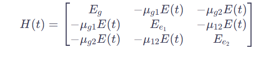
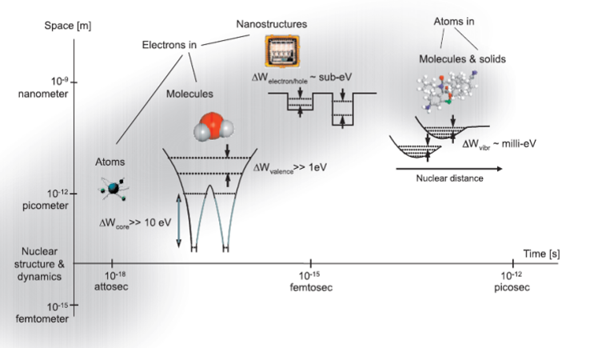
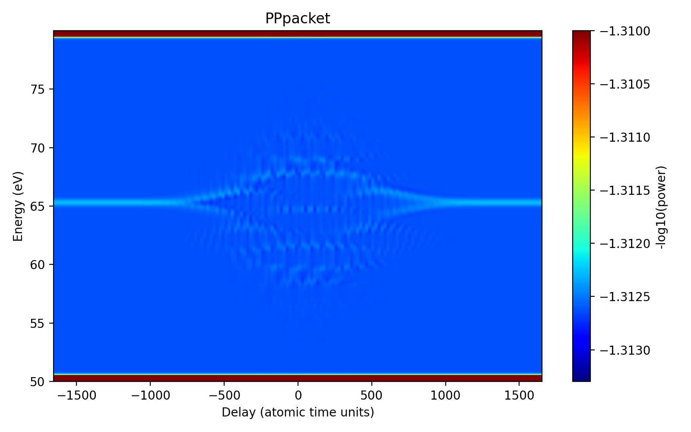

# 氢原子的阿秒瞬态吸收光谱
## 原理
### 1.氢原子的波函数
在量子力学里，氢原子是最简单的原子类型，只包含一个原子核与一个电子。在量子力学里，氢原子的电子并不是单独存在的，其存在的形式是以概率的形式分布的电子云，在这些所有的电子云里，如果电子的动量相同，那么我们完全无法预测他们的位置是在哪里，如果我们单独测量某一个位置的电子云，那么这个地方的电子的动量则完全无法确定。对此，德布罗伊通过黑洞辐射得到了电子的波动性与不确定性关系。
在次基础上，只能利用薛定谔-海森堡方程来进行计算得到在但个质子的原子核内的电子的分布。经过计算之后发现，只要是一个势阱，那么电子在势阱内部的能级就是分立的，处于特定能量下的电子是可以做到稳定存在。于是这里就诞生出了一个概念叫做能级。通过电子谱吸收光谱的能量谱线，科学家们发现微观世界的粒子的能量谱线几乎都不是连续的而是分立的，$$ E_n = -\frac{13.6  \text{eV}}{n^2} $$这些现象完美的证明了量子力学的正确性与普遍性。因此为了表示氢原子的波函数，这里除了最基础的空间分布的波函数，还有希尔伯特空间的能量表象可以使用。在很多涉及氢原子基态的问题里，通常都是使用少能级模型进行问题的解决。对于少能级模型，氢原子的能级通常为：

$$ \psi_{nlm}(r, \theta, \varphi) = R_{nl}(r) \cdot Y_{lm}(\theta, \varphi) $$
其中基态：
$$ \psi_{100}(r, \theta, \varphi) = R_{10}(r) \cdot Y_{00}(\theta, \varphi) = \frac{1}{\sqrt{\pi a_0^3}} e^{-r/a_0} $$
### 2.氦原子的双电子耦合模型
与单个氢原子不同的是，氦原子具有两个电子，它们之间存在相互作用，相比于能够解析解计算出来的氢原子模型，其会出现很多奇特的与单电子不同的现象，比如说，一般而言一个电子的氢原子的激发能量是13.6eV，而氦原子的电子理论上则应该是27.2eV，但是由于氦原子的两个电子之间会相互排斥使得第一个电子的电离能为24.3eV.因此第二个电子会改变第一个电子的能级。
除此之外，氦原子的激发态不再像氢原子一样所有的激发态都是束缚态成为一种相对稳定的态。
双激发态指的是两个电子均不在基态的状态，按理来说他们两个都应该稳定的成为束缚态，但是由于电子云之间的相互作用，他们进行互相传递能量，可以使其中的一个电子变为基态，另一个电子则电离出原子。这里面会产生各种各样的奇妙反应，甚至会产生高次谐波，这种原理至今仍然是产生高次谐波与阿秒激光的方式。

### 3.阿秒脉冲激光与飞秒激光
阿秒脉冲激光一般而言都是产生于飞秒激光的高次谐波，目前实验室里面的阿秒脉冲能够较为稳定的制作出来，但实际上就我了解，至少到我毕业的时候，实验室的制作高次谐波的光纤依然是国外的材料购买，而较为稳定的阿妙脉冲激光器，则是花巨量金钱才能从国外购买的，包括每次维修都需要和外国人联系。
尽管阿秒激光与飞秒激光看起来是类似的，阿秒激光也是飞秒激光的产物，但是由于，激光的频率会影响其与原子相互作用的性质，在原子内部的很多细节行为需要需要越来越短的激光来进行作用才可以成功。像斯塔克效应基本上可以通过飞秒激光就能够探测清楚，而原子内部的电子自旋效应电子耦合自相关等效应则需要阿秒激光的探测才可以。
我们程序里面的阿秒激光则不是作为探测的作用，他是作为激光的激发态的启动方式，例如前面的双激发态，单纯的飞秒激光由于能够不够则不足以使之电离，而阿秒激光则可以顺利的将其激发到激发态上，然后使用飞秒激光与之相互作用产生一系列现象。

### 4.飞秒激光与原子态之间的相互耦合
飞秒激光会使电子产生缀饰态（dressed state）这是由于电子在激发态中会吸收飞秒激光的光子临时增加能量，但是随着飞秒激光的周期导致电子的能量有可能会临时减少，但这终究只是临时的，一旦外界激光消失，这在状态很快就会消失殆尽。这本质上就是原子与激光作用时产生的亚稳态。
通常而言，在能量谱中，会发现在主能量峰的两侧会有两个小峰，这就是缀饰态的表现之一，即floquet 态。除此之外，缀饰态还会导致原子能级的斯塔克效应与 能级分裂等现象。在本次代码中使用的是少能级模型，产生AT分裂和斯塔克效应。

## 算法
### 1.氢原子的少能级模型
对于能够使用少能级模型的氦原子，本次模拟仅仅包含到三个能级，其中我们将基态的能量设为0，讲另外的两个态分别设为65.28eV,63.73eV,其中63.73eV的态并不是因为他是一个真实的态，而是当处于这种情况下，双激发态恰好与其共振发生AT分裂。
由于我们仅仅使用三个能级，因此我们可以直接使用薛定谔方程的矩阵形式来进行计算。


在少能级模型里面，我们需要计算波函数的时间演化，即薛定谔方程，他并不能通过解析形式直接计算出来，我们需要用每一步经过很小时间短的时间步长来进行计算。对于少能级模型，我们可以直接使用矩阵的形式来进行计算。
在量子力学中，演化函数即含时哈密顿量包括动量与势能项，而动量算子需要波函数在动量空间中进行计算，势能项中的势能算子则需要在位置空间中进行计算，因此我们需要使用傅里叶变换来进行动量空间与位置空间的转换。
又由于这仅仅是单个步长的时间就需要进行两次傅里叶变换，因此通常而言这些算法的时间复杂度都是很高的，特别是涉及到三维空间的计算以及多个电子的计算，目前仍然是一个非常困难的难题，
通常而言这部分都是止步于实验室的测量和理论上定性分析。
因此我们直接使用少能级模型能够大大简化计算的时间复杂度。

### 2.激光与原子态的相互作用
激光对原子的作用主要是通过电偶极矩与激光的电场强度的相互作用来进行的，他会影响电子的势能，从而使得电子获得或者失去能量是的电子的能级发生短暂的变化，而激光脉冲的持续时间一般而言都是较短的。这里或许可能制作出较长的飞秒激光，但较长的阿秒激光
则基本上目前是无法制作出来的。因此这种相互作用造成的亚稳态可能会导致很多现象，一种就是导致电子的电离，另一种就是电子的跃迁，我们本次代码写的主要是电子的吸收光谱，也就是最终还是测量光的状态来反应原子的能量吸收情况，不直接测量电子，因此更多反应的是原子内部的
能级跃迁情况。



### 3.瞬态吸收吸收光谱的计算
吸收光谱的测量是一种全光式的测量，由于这种方式不直接测量电子的状态，也不会破坏电子的状态，并且测量光的频谱是目前技术手段比较成熟的，相对于电子的测量。
其原理是通过测量激光在与原子相互作用前后的频谱变化来进行的。由于激光与原子相互作用时，原子会吸收一部分能量从而使得激光的频谱发生变化，因此通过测量这种变化就可以反应出原子的能级结构。
如果某个频率的光子被原子吸收很多，那么其频谱的前后变化也就是吸收光谱变化就很大，就会出现一个吸收峰，吸收峰的位置就对应着原子的能级差。
除此之外，我们这次的模拟还是瞬态吸收光谱，也就是说我们的测量并非是一束光，而是两束光，一束极紫外的阿秒激光，一束近红外的飞秒激光。由于阿秒激光的脉冲持续时间极短，因此其能够瞬间将
原子激发到一个激发态上，然后飞秒激光则会与之相互作用，从而使得原子的能级发生变化，从而使得吸收光谱发生变化。我们将飞秒激光与阿秒激光之间做出一个延时效应，在这个延时下阿秒激光相当于“扫描”了一遍
在飞秒激光缀饰下的原子电子，从而可以“近似”的认为阿秒瞬态吸收光谱是可以在阿秒尺度内反应原子的亚稳态变化，通过模拟这种结构可以进一步理解原子内部的变化，还可以已通过这种方式耿佳佳进一步加深
吸收光谱的理解。通过这种全光的测量方式，说不定以后就能制成越来越廉价的原子内部结构测量仪器。



## 代码说明
### 1.代码结构
我们的cpp代码主要包含以下几个文件：
main.cpp:主函数，包括参数设置，整个程序的运行流程与逻辑，并且包括结果的输出与存储。
plot_all.py 画图的py脚本，我们引入了matlab的组件matplotli来帮助我们画出如同matlab的图像处理一样的图片。
fft_backend.h:由于fftw库对于傅里叶变换的实现需要写很多代码，而我们仅仅需要一个简单的傅里叶变换，因此我们将其封装成一个类，方便我们调用。
fft_utils.h:在我们计算的程序里，我们需要使用到fftshift，这是由于fft的性质决定的，因此我们在这一个文件里面封装了fftshift，不仅如此，我们在最后
的处理结果上需要进行卷积操作来模拟实验结果中的误差问题。我们知道大部分测量结构都是存在误差的，如果我们认为我们的误差是高斯分布的，那么我们可以通过将
理论结果与高斯函数进行卷积，那么就可以得到类似于实验室的结果。
io_utils.h:我们将输出的结果存储起来，由于我们存储的结果包含复数数组，实数数组，实数二维数组(用来画成曲线),复数的矩阵，实数矩阵，因此我们在输出各种数据的时候
尤其是我们需要存储很多数据给python脚本使用的时候，我们是需要将这些输出文件的函数统统用模版元来封装。
rk4_utils.h:在本次计算的过程中，由于使用的微分时间步长的办法，为了尽可能提高精度，使用了四阶隆格库塔法。隆格库塔法还需要计算出导数，因此在该文件里还封装了导数的计算。

### 2.代码细节
本项目以**少能级模型**为主线。核心实现包括：参数配置、含时哈密顿量构造、RK4 时间推进、FFTW 封装、数值稳定性处理与结果输出/可视化。

### 1. 参数设定与配置管理
- **能级与耦合**
  - 采用三能级模型：\(|g\rangle, |e_1\rangle, |e_2\rangle\)。
  - 设定相对能量（单位 eV）：
    - \(E_g = 0\)
    - \(E_{e_1} = 65.28\)
    - \(E_{e_2} = 63.73\)（与双激发/共振相关，便于 AT 分裂的可视化）。
  - 偶极矩（原子单位）：
    - \(\mu_{g,e_1}, \mu_{g,e_2}\) 可配；默认 \(\mu_{e_1,e_2}=0\)（按选择规则，可按需开启）。

- **脉冲与延时**
  - 阿秒 XUV：高斯包络，中心频率 \(\omega_{xuv}\)，脉宽 \(\tau_{xuv}\)。
  - 近红外 NIR：\(\omega_{nir}\)、脉宽 \(\tau_{nir}\)、场强 \(E_0\)。
  - **泵–探延时** \(\Delta t\)：扫描获得瞬态吸收谱。

- **数值积分**
  - 时间步长 `dt`（fs）：默认 \(dt \in [10^{-4}, 10^{-3}]\) 量级，兼顾稳定性与速度。
  - 总步数 `Nt`：由脉冲窗口与延时范围决定。

- **频谱与展宽**
  - 频谱通过对极化/吸收信号做 FFT 获得。
  - 卷积高斯核 \(\sigma\)：模拟仪器函数，改善可读性。

**配置接口（示例）**：  
在 `main.cpp` 中通过结构体集中管理，便于命令行或配置文件覆盖。


### 2. 含时哈密顿量与场耦合

## 含时哈密顿量与场耦合

- **基于能量表象（希尔伯特空间）构造 \(H(t)\)：**

 ## 含时哈密顿量与场耦合

- 基于能量表象（希尔伯特空间）构造 \(H(t)\)：

```math
H(t) =
\begin{bmatrix}
E_g & -\mu_{g1} E(t) & -\mu_{g2} E(t) \\
-\mu_{g1} E(t) & E_{e_1} & -\mu_{12} E(t) \\
-\mu_{g2} E(t) & -\mu_{12} E(t) & E_{e_2}
\end{bmatrix}
```
- **电场 \(E(t)\) 为 XUV 与 NIR 的叠加，可选相位 / CEP：**

  E(t) = E_{\mathrm{xuv}}\!\bigl(t-\Delta t\bigr) + E_{\mathrm{nir}}(t)

  其中每项均为高斯包络 \(\times\) 余弦载波。

- **斯塔克效应 / AT 分裂：**  
  通过 \(E(t)\) 的时变项自然产生能级的瞬时移动与分裂。


### 3. FFTW 封装与频谱生成

虽然少能级模型不必做空间 FFT，但**频谱**需要对时间信号（如极化 \(P(t)\) 或吸收 \(\Delta I(t)\)）做 FFT：

- 在 `fft_backend.h` 中封装复数 1D FFT：
  - RAII 管理 `fftw_plan`，避免泄漏；
  - 预分配输入/输出缓冲，减少多次计划的开销。
```


